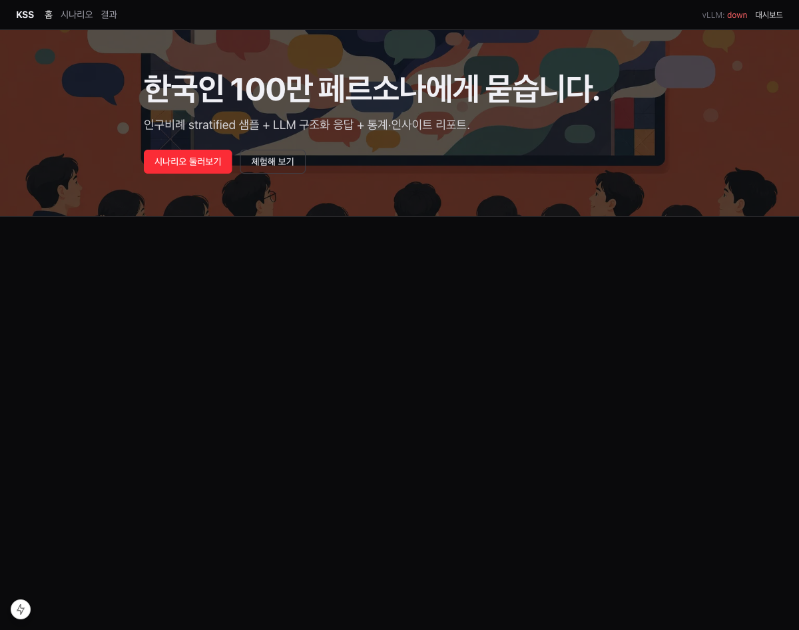
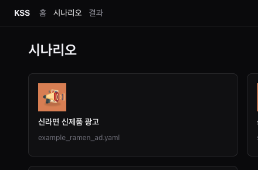
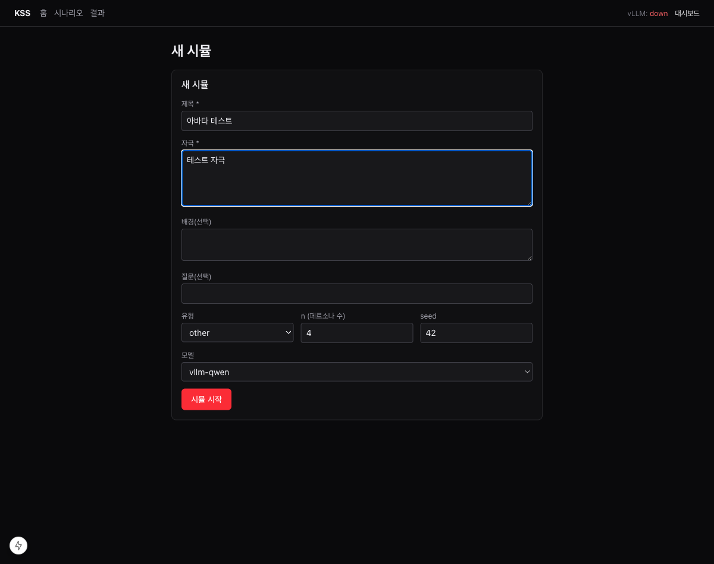
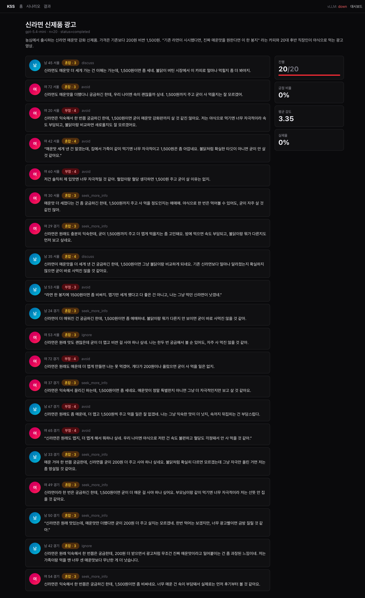

# Korean Social Simulation

> **한국인 100만 페르소나에게 묻습니다.**
> 인구비례 stratified 샘플 + LLM 구조화 응답 + 통계·인사이트 리포트 — 한 번의 명령으로.

<p align="center">
  
</p>

[`nvidia/Nemotron-Personas-Korea`](https://huggingface.co/datasets/nvidia/Nemotron-Personas-Korea) (한국 인구 100만 명 페르소나) 데이터셋에서 **인구비례 샘플**을 뽑아 시나리오(광고·제품·정책 등)에 노출하고, 페르소나별 **구조화된 반응**을 모아 **정량 통계 + LLM 정성 인사이트 리포트**를 자동으로 생성하는 1인 탐색용 시뮬레이션 도구.

> "이 광고를 30대 직장인은 어떻게 받아들일까?", "이 정책에 비수도권 자영업자는 어떤 우려가 있을까?" 같은 질문을 N명의 가상 한국인에게 던져보는 소셜 시뮬레이터.

<!--
🎥 데모 영상 자리 — 실제 시뮬이 돌아가는 10~20초 클립을 여기에 임베드.
GitHub 이슈/릴리즈에 mp4를 업로드한 뒤 그 URL을 아래 <video> 의 src 에 붙여 넣으면 README에서 인라인 재생됩니다.

<video src="https://user-images.githubusercontent.com/…/demo.mp4" controls width="100%"></video>
-->

---

## 핵심 특징

- **인구비례 stratified 샘플링** — `(성별 × 연령대 × 지역)` strata에서 largest-remainder 방식으로 정확히 N명 추출. seed 고정으로 결정적 재현.
- **페르소나 풍부도** — Nemotron-Personas-Korea의 26개 컬럼(인구통계 + 7종 페르소나 텍스트 + 취미·스킬·진로 등)을 그대로 LLM 컨텍스트에 노출.
- **구조화 반응** — Pydantic `with_structured_output` 으로 `stance / intensity / action_intent / key_drivers / concerns / quote` 강제 + `extra_fields` 로 사용자 정의 필드 동적 확장.
- **백엔드 두 종** — vLLM(자체/사내 서버) / Codex OAuth(ChatGPT) 동일 인터페이스.
- **세 가지 UI**
  - **웹 앱 (Next.js + FastAPI)** — 시나리오 선택 → 시뮬 실행 → 라이브 카드 + 차트 + 리포트까지 한 화면.
  - **CLI (`kss run / list / inspect`)** — 스크립트·CI 친화.
  - **Streamlit 대시보드** — 로컬 빠른 탐색·필터링용 보조 UI.
- **단일 디렉터리 산출물** — `runs/<id>/` 안에 입력·반응·차트·`report.md` 까지 무손실 저장.
- **async 코어** — `asyncio.gather` + `Semaphore` 로 동시 LLM 호출 수 제어. 노트북·FastAPI·Streamlit 어디서든 `asimulate(...)` 직접 await.

---

## 둘러보기

### 1) 시나리오 고르기

`scenarios/*.yaml` 에 정의한 각 자극이 카드로 표시됩니다. 아래는 `example_ramen_ad.yaml` 신라면 신제품 광고 시나리오 — 광고 카피·가격·맥락을 한 덩어리로 묶어 페르소나에게 그대로 노출합니다.

<p align="center">
  
</p>

### 2) 한 자리에서 시뮬 시작

시나리오를 고르거나 새 자극을 그 자리에서 입력하고, n / seed / 모델만 정해서 실행.

<p align="center">
  
</p>

### 3) 라이브로 결과 보기

페르소나가 한 명씩 완성될 때마다 quote 카드가 스트리밍되고, 우측 패널에는 진행률 / 긍정 비율 / 평균 강도 / 실패율이 실시간 갱신됩니다. 완료된 run은 stance 도넛 · intent 막대 · 세그먼트 히트맵으로 자동 정리되고, `report.md` 에 통계 표와 LLM 종합 인사이트까지 동봉됩니다.

<p align="center">
  
</p>

> 위는 신라면 신제품 광고 시나리오를 `gpt-5.4-mini` 로 N=20 돌린 실제 결과 — 카피의 "매운맛 + 가격 200원 인상"에 대해 긍정 비율 0% · 평균 강도 3.35 로, 행동 의도는 `seek_more_info` 와 `avoid` 로 갈리는 패턴이 그대로 잡혔습니다.

---

## 빠른 시작

Python 3.13+ / [`uv`](https://github.com/astral-sh/uv) 권장.

### A. 웹 앱 (Next.js + FastAPI) — 메인

가장 풍부한 UI. 시나리오 카드 → 시뮬 실행 → 라이브 카드/차트/리포트를 한 화면에서 본다.

```bash
# 1) Python 백엔드 (FastAPI)
uv sync --extra api
export KSS_OWNER_TOKEN=$(openssl rand -hex 32)
export KSS_COOKIE_SECRET=$(openssl rand -hex 32)
uv run kss serve --host 0.0.0.0 --port 8001

# 2) Next.js 프론트엔드 (별도 터미널)
cd web
npm install
NEXT_PUBLIC_API_BASE_URL=http://localhost:8001 npm run dev
# → http://localhost:3000
```

> `KSS_OWNER_TOKEN` 은 owner 모드 진입용 시크릿, `KSS_COOKIE_SECRET` 은 세션 쿠키 서명용. 운영 시 `.env` 또는 vault 에 보관하세요.

### B. CLI — 스크립트·CI

가장 가볍게 한 줄로 돌리고 `report.md` 까지 받기.

```bash
uv sync                                # 코어 + CLI

uv run kss run \
  --scenario scenarios/example_ramen_ad.yaml \
  --n 200 \
  --model vllm-qwen \
  --seed 42 \
  --insights-model vllm-qwen           # 종합 LLM 인사이트 동봉
```

완료 후 `runs/<timestamp>-<uuid>-<slug>/report.md` 가 생성됩니다.

### C. Streamlit 대시보드 — 로컬 탐색용 보조 UI

웹 앱을 띄우기 부담스러운 1인 탐색 / 노트북 환경 용.

```bash
uv sync --extra dashboard

# Result viewer
uv run kss dashboard runs/<run-id>

# Run launcher — 인자 없이 실행하면 시나리오를 고르고 그 자리에서 시뮬
uv run kss dashboard
```

Overview / Segment / Quote / Extras 탭으로 stance 분포·세그먼트 차트·대표 인용문·사용자 정의 필드 분포를 둘러봅니다.

---

## 환경 변수

| 변수 | 용도 |
|---|---|
| `HF_TOKEN` | HuggingFace rate limit 회피 (선택, 권장) |
| `VLLM_BASE_URL` | vLLM 백엔드 베이스 URL (기본 `http://localhost:8000/v1`) |
| `VLLM_API_KEY` | vLLM API 키 (기본 `EMPTY`) |
| `KSS_OWNER_TOKEN` | FastAPI owner 모드 시크릿 (`kss serve` 시 필수) |
| `KSS_COOKIE_SECRET` | 세션 쿠키 서명 시크릿 (`kss serve` 시 필수) |
| `KSS_CACHE_DIR` | 샘플 캐시 디렉터리 (기본 `~/.cache/korean_social_simulation`) |
| `KOREAN_SOCIAL_SIMULATION_CODEX_OAUTH_AUTH_PATH` | Codex OAuth 자격증명 경로 |

---

## 시나리오 YAML

`scenarios/example_ramen_ad.yaml`:

```yaml
title: "신라면 신제품 광고"
scenario_type: marketing            # marketing | social | product | policy | other
stimulus: |
  농심에서 출시하는 신라면 매운맛 강화 신제품. 가격은 기존보다 200원 비싼 1,500원.
  "기존 라면이 시시했다면, 진짜 매운맛을 원한다면 이 한 봉지" 라는 카피와
  20대 후반 직장인이 야식으로 먹는 광고 영상.
context: |
  국내 라면 시장이 정체되고 있고, 매운맛 카테고리는 삼양 불닭볶음면이 강세인 상황.
question: "이 광고를 본 한국 소비자들은 신제품을 구매하려 할 것인가, 어떤 우려가 있을까?"
```

| 필드 | 필수 | 설명 |
|---|---|---|
| `title` | ✅ | 짧은 식별자, run 디렉터리 슬러그용 |
| `stimulus` | ✅ | 페르소나에게 실제로 노출되는 본문 |
| `scenario_type` | | 5종 enum (기본 `other`) |
| `context` | | 배경 정보 |
| `question` | | 평가 포인트 (LLM에게 전달) |

---

## Python API

### 동기 컨텍스트 (스크립트)

```python
from korean_social_simulation import simulate, Scenario

run = simulate(
    scenario=Scenario(
        title="신라면 광고",
        stimulus="...",
        scenario_type="marketing",
    ),
    n=200,
    model="vllm-qwen",
    seed=42,
    extra_fields={
        "purchase_likelihood": (int, "0~100, 구매 가능성"),
        "willing_price_krw": (int, "지불 의향 가격(원)"),
    },
)
md_path = run.report(insights_model="vllm-qwen")
print(run.df["stance"].value_counts(normalize=True))
```

### async 컨텍스트 (노트북·FastAPI·Streamlit)

```python
from korean_social_simulation import asimulate, Scenario

run = await asimulate(scenario=Scenario(...), n=200, model="vllm-qwen")
md_path = await run.areport(insights_model="vllm-qwen")
```

> ⚠️ 이미 이벤트 루프가 떠 있는 환경(노트북·pytest-asyncio·FastAPI 등)에서 `simulate()` / `run.report()` 동기 wrapper 를 호출하면 명확한 에러로 실패합니다. `asimulate` / `areport` 를 쓰세요.

### 주요 인자

| 인자 | 기본 | 설명 |
|---|---|---|
| `n` | 200 | 샘플 크기 |
| `model` | `vllm-qwen` | `available_models()` 키 |
| `seed` | 42 | 샘플링 재현성 시드 |
| `filters` | `None` | 모집단 필터 (예: `{"province": "서울특별시"}`) |
| `action_intent_choices` | (8종 영문 enum) | Reaction의 `action_intent` 후보 오버라이드 |
| `extra_fields` | `None` | `{name: (type, "desc"), ...}` 동적 필드 추가 |
| `min_cell_threshold` | 5 | 희소 셀 경고 기준 (0이면 비활성) |
| `concurrency` | (백엔드별 기본) | 동시 LLM 호출 수 |
| `runs_root` | `runs` | 산출물 루트 |

---

## 모델 백엔드

`src/korean_social_simulation/llm/factory.py` 에 등록된 프리셋:

| 모델 ID | 백엔드 | 기본 동시성 | 비고 |
|---|---|---|---|
| `vllm-qwen` | vLLM (Qwen2.5-72B-Instruct) | 16 | `VLLM_BASE_URL` 필요 |
| `vllm-exaone` | vLLM (EXAONE-3.5-32B-Instruct) | 16 | `VLLM_BASE_URL` 필요 |
| `gpt-5.5` | Codex OAuth | 2 | OAuth 로그인 필요 |
| `gpt-5.4` | Codex OAuth | 2 | OAuth 로그인 필요 |
| `gpt-5.4-nano` | Codex OAuth | 2 | OAuth 로그인 필요 |

### Codex OAuth 로그인

ChatGPT Plus/Pro 계정 기반 OAuth 로 ChatGPT 컨슈머 백엔드(`chatgpt.com/backend-api`)에 접근합니다. 일반 OpenAI API 키와는 별개입니다.

```bash
# 자동 콜백 (브라우저가 열리는 환경)
uv run python -m korean_social_simulation.llm.codex_oauth login

# 수동 (헤드리스 / 원격 SSH)
uv run python -m korean_social_simulation.llm.codex_oauth login --manual

# 자격증명 삭제
uv run python -m korean_social_simulation.llm.codex_oauth logout
```

자격증명은 `~/.korean_social_simulation/codex_oauth/auth.json` 에 0600 권한으로 저장되며, 만료 직전 refresh token으로 자동 갱신됩니다. 경로는 `KOREAN_SOCIAL_SIMULATION_CODEX_OAUTH_AUTH_PATH` 로 변경 가능.

---

## CLI 레퍼런스

```bash
uv run kss --help
```

| 명령 | 설명 |
|---|---|
| `kss run --scenario PATH [...]` | 시나리오 YAML로 시뮬 실행 + `report.md` 생성 |
| `kss list [--limit N]` | 최근 run 디렉터리 목록 |
| `kss inspect runs/<id>` | run의 메타·stance 분포 출력 |
| `kss dashboard [runs/<id>]` | Streamlit 대시보드 실행 (`--extra dashboard` 필요). 인자 생략 시 launcher 모드 |
| `kss serve [--host H --port P]` | FastAPI 백엔드 시작 (`--extra api` 필요). `KSS_OWNER_TOKEN`, `KSS_COOKIE_SECRET` 필요 |

---

## Run 디렉터리 구조

```
runs/<YYYYMMDD-HHMMSS-uuid>-<slug>/
├── scenario.json          # 입력 + meta(model/n/seed/dataset_fingerprint/sampler_version 등)
├── reactions.parquet      # 페르소나별 반응 결과 (DataFrame)
├── sample.parquet         # 추출된 페르소나 메타
├── charts/                # 세그먼트 차트 PNG
└── report.md              # 통계 + (선택) LLM 종합 인사이트
```

기존 디렉터리는 절대 덮어쓰지 않으며, 같은 run_id 충돌 시 `FileExistsError` 로 보호됩니다.

### Reaction 스키마

| 필드 | 타입 | 설명 |
|---|---|---|
| `stance` | `positive`/`negative`/`neutral`/`mixed` | 전반적 입장 |
| `intensity` | `int` 1~5 | 반응 강도 |
| `action_intent` | enum (기본 8종) | 행동 의도 (`purchase`, `advocate`, `share`, `discuss`, `seek_more_info`, `ignore`, `avoid`, `reject`) |
| `key_drivers` | `list[str]` 1~3 | 핵심 이유 |
| `concerns` | `list[str]` | 우려 포인트 |
| `quote` | `str` | 친구·동료에게 할 법한 1~2문장 |

여기에 `extra_fields` 로 `purchase_likelihood`, `willing_price_krw` 같은 필드를 동적으로 추가할 수 있습니다.

---

## 재현성

- **데이터셋**: `_version.py:DATASET_REVISION` 으로 HF 커밋 SHA 고정. 모든 run의 `meta.dataset_fingerprint` 에 결정적 해시 기록.
- **샘플링**: `(seed, dataset_fingerprint, n, filters, sampler_version)` 키로 캐시. 동일 입력은 동일 행 반환.
- **샘플러 버전**: 알고리즘이나 strata 스키마 변경 시 `SAMPLER_VERSION` bump → 기존 캐시 자동 무효화.

---

## 개발

```bash
uv sync --all-extras                 # dev deps 포함
uv run pytest                        # 기본 테스트
uv run pytest -m live                # HF 네트워크 필요 케이스
uv run ruff check . && uv run ruff format --check .
```

테스트 구성:
- `tests/test_e2e.py` — end-to-end 통합 (mock LLM)
- `tests/test_simulate.py` / `test_run.py` / `test_reaction.py` / `test_scenario.py`
- `tests/data/` — 샘플러 인구비례·재현성
- `tests/llm/` — 프롬프트·factory·codex_oauth 호환성
- `tests/report/` — 차트·markdown·insights
- `tests/test_dashboard_smoke.py`

---

## 라이선스 & 크레딧

이 프로젝트의 **소스 코드는 [Apache License 2.0](LICENSE)** 하에 배포됩니다. 재배포 시 [NOTICE](NOTICE) 파일을 함께 포함해 주세요.

### 데이터 출처 (Attribution)

이 프로젝트는 NVIDIA Corporation의 [`nvidia/Nemotron-Personas-Korea`](https://huggingface.co/datasets/nvidia/Nemotron-Personas-Korea) 데이터셋을 사용하며, 해당 데이터셋은 [Creative Commons Attribution 4.0 International (CC BY 4.0)](https://creativecommons.org/licenses/by/4.0/) 라이선스를 따릅니다.

- 데이터셋 자체는 본 저장소에 포함·재배포되지 않으며, 런타임에 Hugging Face Hub에서 직접 로드합니다.
- 본 프로젝트는 데이터를 필터링·인구비례 샘플링해 사용할 뿐 원본 레코드를 수정하지 않습니다.
- 샘플링된 페르소나에 대한 LLM 반응 결과(`reactions.parquet` 등)는 데이터셋의 derivative work에 해당할 수 있으므로, 외부에 공개·공유할 때는 동일하게 NVIDIA / Nemotron-Personas-Korea 출처를 표기해 주세요.

### 크레딧

- Codex OAuth 어댑터는 MIT-licensed [`langchain-codex-oauth`](https://github.com/AnthonyTlei/langchain-codex-oauth) 프로젝트를 참고한 in-tree 포팅입니다.
